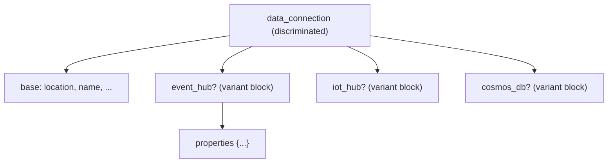

# Discriminated (Polymorphic) Type Support — Research Report

Research only. No code changed. All claims grounded by reading the sources
cited inline (file:line).

## 1. Current behavior (the drop site)

`internal/native/typegraph/walker.go:387` — the `resolve()` `default` case
collapses every `DiscriminatedObjectType` to `KindAny`:

```go
default:
    // DiscriminatedObjectType, ResourceType, ResourceFunctionType, etc.
    // Polymorphic/discriminated bodies are emitted as a dynamic attribute.
    t = &Type{Kind: KindAny, Name: entry.Name}
```

The raw fields **are already parsed** but then discarded
(`walker.go:218-221`): `Elements json.RawMessage` (for a discriminated type
this is a JSON **object** `{discriminatorValue: {$ref}}`, unlike `UnionType`'s
array), `BaseProperties map[string]*rawProperty`, `Discriminator string`.

Downstream consequence:

- **Emitter** (`internal/native/generator/emitter.go:544-556`): `KindAny` →
  `schema.DynamicAttribute` at top level / inside `SingleNestedAttribute`,
  degrading to `schema.StringAttribute` inside a `ListNestedAttribute` (the
  framework forbids nested dynamic).
- **Mapper** (`internal/native/mapper/mapper.go:109-118`, `:231-236`):
  `KindAny` ↔ `types.Dynamic` via `dynamic.ToJSON` / `dynamic.FromJSONImplied`
  — an opaque JSON blob the practitioner writes by hand, with **no schema, no
  validation, no per-field plan diffing**.
- **Root-body discriminated** resources are skipped entirely — they fall back
  to the untyped `azapi_resource`.
- Design docs (`internal/native/DEVELOPER_SPEC.md:99`,
  `internal/native/GENERATOR.md:574-578`) mark full typing as deferred Phase-3
  work; the only sanctioned path today is a per-resource customizer that types
  the discriminator enum while leaving the body dynamic.

This is a real gap: a dynamic attribute gives the practitioner zero
autocomplete, zero validation, and forces raw JSON — exactly what native
typing exists to eliminate.

## 2. Prevalence (why it matters)

Measured across all 3,001 `types.json` files in `internal/azure/generated`:

| Metric | Count |
|---|---|
| `DiscriminatedObjectType` definitions | **719** |
| ResourceTypes whose **root body** is discriminated (fully skipped today) | **632** |
| Variant-count distribution | mostly 1–3 (4,670), long tail to 121 |

Variant-count histogram (variants → occurrences): `{1: 1770, 2: 1692, 3: 1208,
4: 371, 5: 410, 6: 400, 7: 226, 8: 63, 9: 131, 10: 176, 11: 89, 12: 40, ...,
121: 1}`.

Concrete shapes inspected:

- **Kusto `DataConnection`** — discriminator `kind`, base
  `{location,id,name,type,systemData}`, 6 variants (`EventHub`, `IotHub`,
  `CosmosDb`, `EventGrid`, `EventGridWithManagedIdentity`,
  `EventHubWithManagedIdentity`), each `{properties, kind}`.
- **Authorization `RoleManagementPolicyRule`** — discriminator `ruleType`,
  base `{id,target}`, 6 variants with **disjoint** property sets.
- **DataProtection `ItemLevelRestoreCriteria`** — discriminator `objectType`,
  base `{}`, 6 variants; here some property **names repeat across variants**
  (`includeClusterScopeResources`, `includedNamespaces`, …), a few with
  identical types. This is the decisive fact for choosing a design.

## 3. ARM wire shape

A discriminated value is a **single flat JSON object**:
`{ <discriminator>: "<value>", <baseProps…>, <variantProps…> }`. The `elements`
map key IS the discriminator value (`kind:"EventHub"`). The per-variant
`properties` map always re-declares the discriminator as a `StringLiteralType`
pinned to that value — so it is redundant and must be synthesized, not surfaced
to the user.

## 4. Design options

### Option D — Status quo (dynamic blob)

Keep `KindAny`. Zero work, zero benefit. Baseline for comparison.

### Option C — Partial typing (discriminator enum + dynamic body)

Type only the discriminator as a `StringAttribute`+`OneOf`; body stays
`types.Dynamic`. This is the documented customizer opt-in
(`DEVELOPER_SPEC.md:99`). Marginal: still hand-written JSON for the payload.
Rejected as a primary answer — it does not deliver typed configs. Retained as a
**fallback** for pathological wide unions.

### Option A — Flattened union (single object, all variant props merged)

One `SingleNestedAttribute` = base props ∪ discriminator enum ∪ **every**
variant's props (all Optional), plus a conditional validator "given
discriminator=X, only X's props allowed."

Tradeoffs:

- Flattest UX; no extra nesting depth.
- **Property-name collisions across variants** (proven present in
  `ItemLevelRestoreCriteria`). Same-name/same-type merges silently;
  same-name/**different-type** is unrepresentable in a single `AttributeTypes`
  map → forces per-collision dynamic fallback. Fragile.
- ExactlyOneOf cannot express variant membership; needs a bespoke conditional
  `ConfigValidator` keyed on discriminator value.
- Nothing existing handles a merged pseudo-object; all-new machinery.

### Option B — Nested per-variant blocks (RECOMMENDED)

One `SingleNestedAttribute` whose attributes are the **base props** plus one
**Optional `SingleNestedAttribute` per variant** (named by the snake_cased
variant, e.g. `event_hub`, `iot_hub`), each containing that variant's own
properties (minus the synthesized discriminator). An `ExactlyOneOf` constraint
spans the variant blocks; the discriminator value is **derived** from which
block is set.



Tradeoffs:

- **No name collisions** — each variant is isolated in its own object.
- Each variant block is a plain `KindObject`; the **existing**
  emitter/mapper/validator/customizer recursion already handles it at arbitrary
  depth (including nested discriminators).
- Works **inside arrays** — `SingleNestedAttribute` is legal inside
  `ListNestedAttribute`, unlike dynamic. Fixes the collection-degradation
  problem for free.
- **Reuses the existing relational `ExactlyOneOf`** machinery end-to-end
  (`internal/native/services/registry.go` `RelationalConstraint` →
  `internal/native/resource/configvalidators.go`), which already validates
  nested absolute snake_case paths.
- Idiomatic — mirrors the azurerm "one block per type" convention
  practitioners know.
- Costs +1 nesting level in config.
- One genuinely new piece: the **flat↔nested transform** in the mapper (ARM is
  a flat object; TF nests the variant). This is the crux of the work, but it is
  localized.

**Recommendation: Option B**, with Option C available as the customizer
fallback for pathological wide unions (e.g. the 121-variant tail) where a
customizer can force `KindAny`.

## 5. End-to-end change map (Option B)

Every seam a new `KindDiscriminated` must thread through, in dependency order.
All confirmed by reading the code:

| # | File / symbol | Change |
|---|---|---|
| 1 | `typegraph/walker.go:30-55` — `TypeKind`, `Type` | Add `KindDiscriminated`; add `Discriminator string` + `Variants map[string]*Type` (variant value → object type). `BaseProperties` fold into `Properties`. |
| 2 | `typegraph/walker.go:387` — `resolve()` default | Decode `Elements` as `map[string]rawRef`, resolve base props + each variant object, build `KindDiscriminated`. Keep the recursion/depth guards. |
| 3 | `typegraph/computed.go` — `EffectiveComputed`/`IsFullyComputed` | Recurse base + variants. |
| 4 | `typegraph/postprocess.go` | `promoteSingleOptional`, `extractDefaults`, validator extraction must walk variants. |
| 5 | `generator/emitter.go` — `emitAttribute` (+`scanImportNeeds`, `planModifierFor`, `attrTypeLiteral`, `emitAttributes`) | Emit base attrs + per-variant `SingleNestedAttribute`; synthesize an `ExactlyOneOf` relational constraint over the variant paths. |
| 6 | `generator/invariants.go` — `checkObjectInvariants` | Recurse variants. |
| 7 | `validate/validate.go` — parity mapper (`validateType`, `isStringCompat`, `bicepDesc`) | Add discriminated parity rules; stop treating it as `Any`. |
| 8 | `mapper/mapper.go` — `expandValue` (config→ARM) | **Flat merge**: find the non-null variant block → emit base props + variant props + `discriminator:"<value>"` into one flat object. |
| 9 | `mapper/mapper.go` — `Flatten`/`flattenValue`/`flattenValueInto`/`flattenInto` (ARM→state) | **Nest**: read discriminator from the flat ARM object → route base props to base attrs, variant props into the matching block, null the other blocks. |
| 10 | `generator/walker_integration_test.go:164` — `TestParseDiscriminatedObjectType` | Currently pins `DynamicAttribute`; must be rewritten to assert typed blocks. |

**No hook changes required.** The `Hooks`/`CrudCtx` layer
(`internal/native/resource/hooks.go`) operates on `map[string]interface{}` ARM
bodies and typed `types.Object`; because the mapper already produces the
correct flat ARM `Body`/`Response`, hooks keep working unchanged. Customizers
(`internal/native/generator/customizers/customizers.go`) already mutate the
type graph in place and can reach into variant subtrees via `FindProperty`-style
helpers (may need a variant-aware path accessor).

## 6. Key risks

1. **Flat↔nested mapper transform** (#8/#9) is the only conceptually new logic.
   It must be exactly invertible for idempotency, and `flattenInto`'s
   base-preservation (sensitive/write-only/omitted-field retention) must thread
   through the chosen variant only.
2. **Discriminator synthesis**: skip the redundant per-variant discriminator
   `StringLiteralType` property on emit; re-inject it on expand. Getting this
   wrong leaks a phantom required field.
3. **Wide unions** (121 variants) would emit an unusably large schema — gate
   with a variant-count threshold that falls back to `KindAny`, overridable per
   resource by customizer (Option C).
4. **Nested discriminators** (a variant contains another discriminated type) —
   handled naturally by recursion since each variant is a `KindObject`, but
   needs a test.
5. **`ExactlyOneOf` semantics**: variants are mutually exclusive AND the block
   is often optional/required as a whole — verify whether it should be
   `ExactlyOneOf` (exactly 1) vs `AtMostOneOf`, per whether the discriminated
   body is required.

## 7. Effort estimate

Medium. ~10 localized edits, no cross-subsystem contract churn (the
`services.Descriptor` / hook / runtime interfaces are untouched — the mapper
absorbs the shape change). The relational-constraint and nested-object
machinery already exists and is reused wholesale. Bulk of the effort and test
surface is items #8–#9 (mapper round-trip) plus emitter output.

## 8. Recommendation

Adopt **Option B (nested per-variant blocks)**. Suggested rollout: implement the
generator + mapper change behind a variant-count fallback, then validate on a
single pilot resource first — Kusto `DataConnection` (6 clean disjoint variants,
non-trivial but no name collisions) — before enabling the 632 root-body
discriminated resources broadly.
