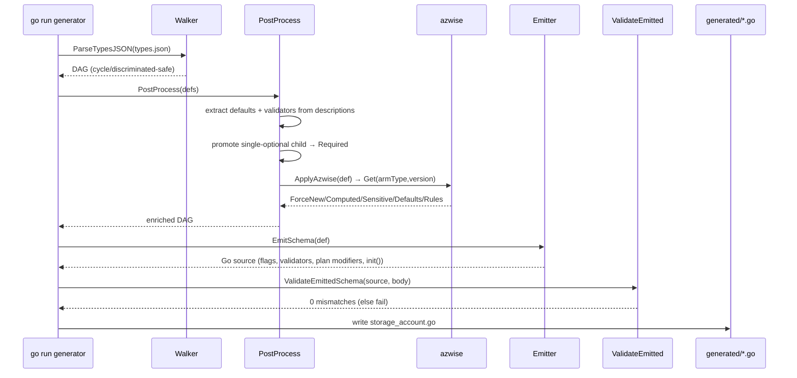
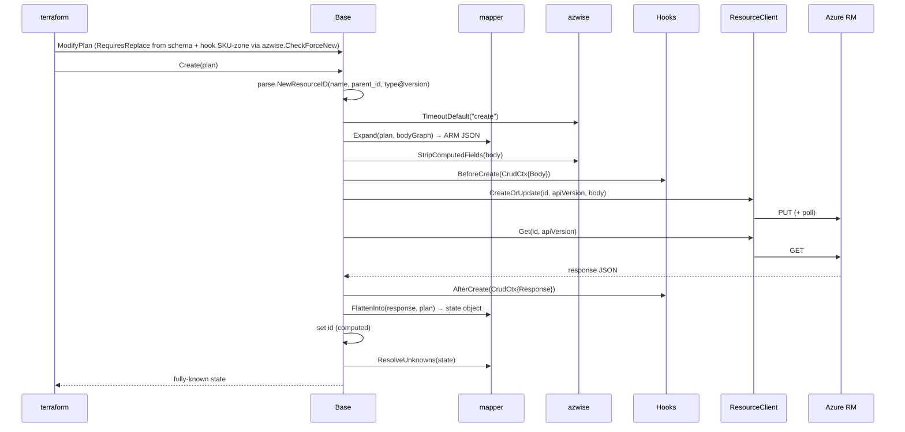
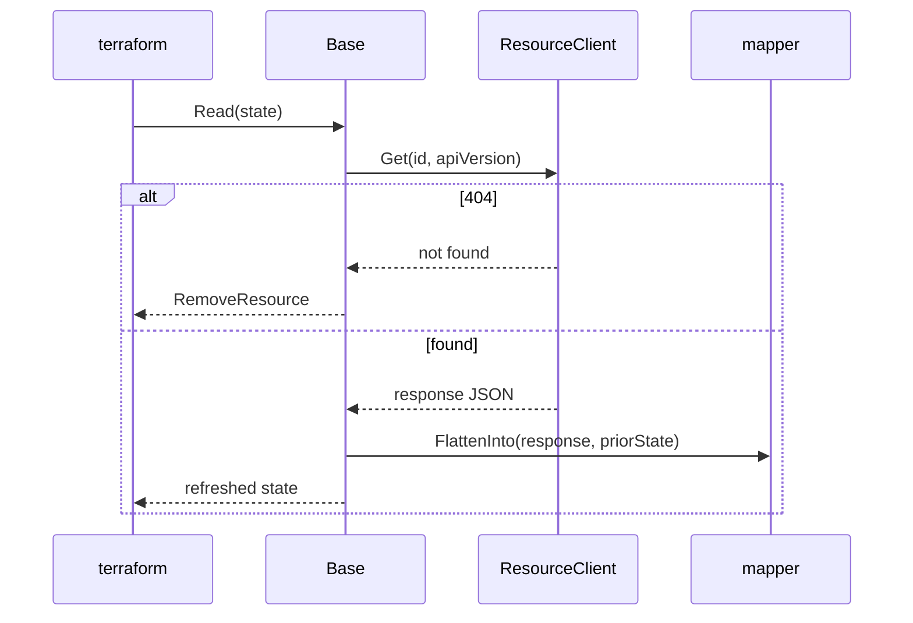

# azapin (azapi-native/next) — Development Specification

Status: Draft (PoC proven end-to-end against live Azure; productionization in progress)
Owners: azapi provider team
Related docs: `DESIGN.md`, `GENERATOR.md`, `RESOURCE.md` (under `internal/azapin/`),
`azapin-vs-azapi.md`, `static-schema-generation-analysis.md`,
`approach-comparison-report.md` (under `tools/azwise/`).

---

## 1. Project Overview & Goals

### 1.1 Purpose

**azapin** generates **static, typed Terraform resources** for Azure (e.g.
`azapi_storage_account`) from the bicep type definitions Azure already publishes,
and layers **azwise** — curated AzureRM-derived operational knowledge — on top so
the resources behave like hand-written AzureRM resources rather than a raw spec
dump. The resources ship inside the existing **terraform-provider-azapi** binary,
alongside the dynamic `azapi_resource`.

Two subsystems:

- **azwise** (`internal/azure/azwise/`) — a registry of per-resource operational
  knowledge (ForceNew rules, validation, real default values, sensitive/computed
  classification, timeouts). Consumed at runtime by `azapi_resource` and at
  build-time by the azapin generator.
- **azapin** (`internal/azapin/`) — the static-schema generator, the generic
  runtime resource base, and the supporting tooling (validators, acceptance
  framework, CLI).

### 1.2 Business problem

AzureRM remains important, but feature delivery is constrained by finite review
bandwidth and by a provider stack that depends on Pandora and the HashiCorp SDK,
where upstream swagger or SDK churn can stall new-resource work or maintenance.
azapin is one response to that constraint: improve the azapi user experience,
reuse Azure's own published type data directly, and make migration from AzureRM to
azapi materially easier for customers who want typed resources without waiting for
full AzureRM coverage.

`azapi_resource` is the universal, day-zero way to manage any Azure resource. It
already validates the dynamic `body` against the embedded ARM/bicep types at plan
time (`schemaValidate`, on by default via `schema_validation_enabled`). In VS Code,
the Azure Terraform extension/LSP already adds body completion, hover, and
diagnostics for azapi resources. But that help lives in an external editor
integration, not in the provider schema itself: core Terraform still sees one
dynamic `body`, errors land on JSON paths rather than typed attributes,
computed/read-only values aren't part of the resource (you reach them via
`response_export_values` → `.output`), defaults are not injected, and there is no
per-attribute lifecycle modeling (ForceNew, computed handling, real defaults).
Teams that want an **AzureRM-like authoring experience** — a native typed schema
with per-attribute validation, editor support that comes from the provider itself,
first-class computed attributes, and correct lifecycle — must otherwise wait for
AzureRM to add the resource or hand-write provider code. azapin closes that gap by
generating those typed resources mechanically from Azure's own schema, with azwise
supplying the human-curated nuances a raw spec can't express.

### 1.3 Target audience

- **Terraform practitioners** managing stable Azure resources who want
  autocomplete, validation, and clean diffs without leaving the azapi provider.
- **Provider maintainers** who want to expand typed coverage at codegen speed
  instead of per-resource hand-authoring.
- **Teams migrating from / comparing against AzureRM** who want parity behavior on
  the azapi backend.

### 1.4 Goals & non-goals

**Goals**
1. Generate framework-valid typed schemas for the latest stable API version of each
   stable ARM resource type (~2,631 types).
2. One generic runtime base implementing the full Terraform resource lifecycle —
   no per-resource Go struct.
3. Overlay azwise knowledge to deliver ForceNew, verified defaults, validation, and
   sensitive/computed correctness.
4. Coexist with `azapi_resource`; identical auth, client, and backend.
5. Per-resource customization seams (hooks + method override).

**Non-goals**
1. Replacing `azapi_resource` (it remains the day-zero / preview / escape hatch).
2. Generating per-resource Go model structs.
3. Statically typing polymorphic/discriminated bodies (fall back to dynamic).
4. AzureRM property-name parity (azapin uses mechanical snake_case from the spec).

---

## 2. User Requirements

User stories with acceptance criteria. **MUST/SHOULD/MAY** per RFC 2119.

### 2.1 Practitioner — author a typed resource

> As a Terraform user, I want to declare an Azure storage account with named,
> typed attributes so I get autocomplete and plan-time validation.

**Acceptance**
- `azapi_storage_account` exposes ARM body properties as typed attributes in
  snake_case (`sku`, `properties.access_tier`, …). **MUST**
- `terraform validate` rejects unknown attributes and wrong types before apply. **MUST**
- Enum attributes reject out-of-set values via schema validators. **MUST**
- The resource MUST create the identical ARM resource a `azapi_resource` with the
  equivalent `body` would.

### 2.2 Practitioner — clean plans

> As a Terraform user, I want `apply` then `plan` to be empty (no perpetual diff).

**Acceptance**
- After a successful `apply`, a follow-up `plan` with unchanged config MUST be
  empty (idempotent).
- Server-computed values (e.g. `properties.primary_endpoints`, `provisioning_state`)
  MUST round-trip into state and not re-plan as `(known after apply)`.
- Apply results MUST be fully known (no unknown values returned post-apply).

### 2.3 Practitioner — correct lifecycle

> As a Terraform user, I want only the right changes to force replacement.

**Acceptance**
- Changing a declared ForceNew property (e.g. `properties.is_hns_enabled`) MUST plan
  a replace; changing a normal property MUST plan an in-place update.
- Conditional rules that a static modifier can't express (e.g. storage **SKU
  zone-migration** `Standard_LRS → Standard_ZRS`) MUST force replace, while an
  in-tier SKU change MUST NOT. **MUST**
- Read-only attributes MUST be `Computed` and MUST NOT be sent in the request body.
- Optional attributes with a known AzureRM default SHOULD surface that default at
  plan time rather than `(known after apply)`.

### 2.4 Practitioner — import & outputs

**Acceptance**
- `terraform import azapi_storage_account.x <armId>` MUST hydrate typed state from a
  GET. **MUST**
- Computed values MUST be referenceable directly
  (`azapi_storage_account.x.properties.primary_endpoints.blob`) without
  `response_export_values`. **MUST**

### 2.5 Maintainer — add a resource

> As a maintainer, I want to add a new typed resource by generating it.

**Acceptance**
- Running the generator for an ARM type produces a compiling `*.go` schema file that
  passes `Schema.ValidateImplementation`. **MUST**
- The generated schema MUST cover exactly the bicep body properties (validated by
  the schema↔bicep cross-validator: no extra, no missing of type-mismatched). **MUST**
- The resource auto-registers (via `init()` → `generated.Registry`) and the provider
  exposes it with no further wiring. **MUST**

### 2.6 Maintainer — customize a resource

> As a maintainer, I want to add resource-specific logic without forking the base.

**Acceptance**
- A hand-written overlay MAY register `Hooks` (Before/After per op, ModifyPlan,
  ValidateConfig) keyed by resource name. **MUST be supported**
- A resource MAY override a base method via Go embedding when hooks are
  insufficient. **MUST be supported**

### 2.7 Maintainer — curate knowledge (azwise)

**Acceptance**
- azwise knowledge MUST be expressible declaratively (ForceNew paths, string/int
  rules, sensitive/computed fields, default values, timeouts).
- The generator MUST apply azwise as an overlay that wins over heuristics.
- azwise MUST be toggleable for `azapi_resource` via the
  `disable_resource_knowledge` provider feature.

### 2.8 Operator — safe defaults

**Acceptance**
- With `TF_ACC` unset, acceptance suites MUST skip (no Azure calls).
- azwise validation MUST NOT false-positive (only flag sensitive/computed fields
  actually present in the body).

---

## 3. System Architecture & Tech Stack

### 3.1 Tech stack

| Concern | Choice |
|---|---|
| Language | Go (module `github.com/Azure/terraform-provider-azapi`) |
| Provider framework | `terraform-plugin-framework` v1.19.0 (Protocol v6) |
| Plugin protocol | tfprotov6 via `providerserver.NewProtocol6WithError` |
| Acceptance testing | `terraform-plugin-testing` v1.16.0 + **Ginkgo** v2.21.0 / **Gomega** v1.34.2 |
| Unit testing | Go `testing` + `testify` |
| "Database" | None. Two embedded, read-only data sources: the **bicep type graph** (`internal/azure/generated`, `go:embed`) and the **azwise knowledge registry** (compiled Go) |
| External API | Azure Resource Manager REST (via `internal/clients.ResourceClient`) |
| Code generation | Custom Go generator (`internal/azapin/generator`), run via `go run` / `go generate` |

There is **no frontend, no server, no database**. The "frontend" is the Terraform
CLI; the "backend" is the provider plugin process plus ARM.

### 3.2 Component map

```
terraform CLI ──tfprotov6──► terraform-provider-azapi (plugin process)
                                  │
        ┌─────────────────────────┼──────────────────────────────┐
        ▼                         ▼                              ▼
  azapi_resource          azapin runtime resource          azapi data sources
  (dynamic body)          internal/azapin/resource.Base    (unchanged)
        │                         │
        │                  ┌──────┴───────┐
        │                  ▼              ▼
        │            mapper (state↔   loader (bicep body
        │            ARM JSON)        type graph, cached)
        ▼                  │              │
   internal/clients.ResourceClient ──REST──► Azure Resource Manager
        ▲                  ▲
        │                  │
   internal/azure/azwise (knowledge): Validate / CheckForceNew /
   StripComputedFields / TimeoutDefault — used by BOTH paths
```

Build-time (not in the plugin process):

```
internal/azure/generated/*/types.json  (embedded source of truth)
        │
        ▼  internal/azapin/generator
  ParseTypesJSON ─► PostProcess(+ApplyAzwise from azwise) ─► EmitSchema
        │                                                       │
        ▼ ValidateEmittedSchema (source-string)                 ▼
  internal/azapin/generated/<resource>.go  ──compiled──►  runtime Registry
        ▲
  internal/azapin/validate (compiled-schema cross-check, run as test/CLI)
```

### 3.3 Package responsibilities

| Package | Responsibility |
|---|---|
| `internal/azure/azwise` | Knowledge registry + interface; `Validate`, `CheckForceNew`, `StripComputedFields`, `TimeoutDefault`, `SchemaKnowledge` accessors |
| `internal/azapin/naming` | ARM type → TF resource name; camelCase ↔ snake_case |
| `internal/azapin/generator` | `types.json` walker, post-processing, azwise overlay, schema emitter, source-string validator |
| `internal/azapin/schema` | Runtime static-default impls + plan-modifier vendoring anchors |
| `internal/azapin/mapper` | Generic state ↔ ARM JSON (`Expand`/`Flatten`/`FlattenInto`/`ResolveUnknowns`) |
| `internal/azapin/resource` | Generic `Base` resource, hooks, body loader, overlays |
| `internal/azapin/generated` | Generated resource files + `Descriptor` registry |
| `internal/azapin/validate` | Compiled-schema ↔ bicep cross-validator |
| `internal/azapin/acceptance` | Ginkgo BDD acceptance framework |
| `internal/azapin/cmd/azapin-validate` | Standalone validation CLI |

---

## 4. Technical Design

### 4.1 Data models

#### Bicep type graph (`generator`)

```go
type Type struct {
    Kind        TypeKind            // String, StringLiteral, Int, Bool, Object, Array, Union, Any
    Name        string              // ARM struct/enum name (or literal value)
    Properties  map[string]*Property // ObjectType, keyed by ARM camelCase name
    ElementType *Type               // ArrayType element
    Elements    []*Type             // UnionType members
}

type Property struct {
    Name         string       // ARM JSON name (camelCase)
    Type         *Type
    Flags        PropertyFlag // Required | ReadOnly | WriteOnly | SystemManaged (bicep bits)
    Description  string
    DefaultValue string                 // description-mined or azwise-verified
    Validators   []DescriptionValidator // ARM-ID / regex / range / OneOf / length
    ForceNew      bool        // azwise overlay → RequiresReplace
    Sensitive     bool        // azwise overlay → Sensitive: true
    ForceComputed bool        // azwise overlay → Computed-only
}
```

The walker resolves `$ref` into a **DAG** (shared nodes, cycle-broken by an
in-progress set — recursive back-edges become a `KindAny` sentinel).

#### azwise knowledge

```go
type ResourceKnowledge interface {
    GetResourceType() string
    GetApiVersions() []string
    Validate(name string, body map[string]any, hasSensitiveBody bool) diag.Diagnostics
    CheckForceNew(oldBody, newBody map[string]any) bool
    TimeoutDefault(op string, fallback time.Duration) time.Duration
    GetComputedFields() []string
    GetDefaultValues() []DefaultValue
    GetRequiredFields() []string
}
type SchemaKnowledge interface { // consumed by the generator
    GetForceNewPaths() []string
    GetSensitiveFields() []string
    GetStringRules() []StringRule
    GetIntRules() []IntRule
    GetFloatRules() []FloatRule
}
// BaseKnowledge implements both; concrete resources embed it (storage_account.go, …).
```

#### Generated descriptor & runtime base

```go
// internal/azapin/generated
type Descriptor struct {
    Name       string // "azapi_storage_account"
    ARMType    string // "Microsoft.Storage/storageAccounts"
    APIVersion string // "2025-01-01"
    Schema     func() schema.Schema
}
var Registry = map[string]Descriptor{} // populated by each generated init()

// internal/azapin/resource
type Base struct { desc Descriptor; hooks *Hooks; provider *clients.Client }
type Hooks struct {
    BeforeCreate, AfterCreate, BeforeUpdate, AfterUpdate,
    BeforeRead, AfterRead, BeforeDelete func(*CrudCtx)
    ValidateConfig func(ctx, req, resp)
    ModifyPlan     func(ctx, req, resp)
}
type CrudCtx struct {
    Ctx context.Context; Client *clients.Client; ID parse.ResourceId
    Plan, State types.Object
    Body, Response map[string]any
    Diags *diag.Diagnostics
}
```

### 4.2 Composed schema

The generated schema covers the ARM **body** (`location`, `tags`, `sku`, `kind`,
`identity`, `properties`, …). The base wraps it with the envelope:

```
final schema = generated body attributes
             + name      (Required, RequiresReplace)
             + parent_id (Required, RequiresReplace)
             + id        (Computed,  UseStateForUnknown)
             + timeouts  (block: create/read/update/delete)
```

### 4.3 Generation pipeline (build-time sequence)



### 4.4 Create / Update (runtime sequence)



### 4.5 Read / refresh



### 4.6 Mapper contract (state ↔ ARM JSON)

- **Expand**: walk the bicep body graph; for each non-SystemManaged property read
  the plan attribute by `CamelToSnake(armName)`; skip null/unknown; emit keyed by
  the **ARM camelCase name from the graph** (never by reversing snake_case).
- **Flatten / FlattenInto**: walk the graph/schema; only overwrite body attributes
  the response actually contains (preserves write-only and envelope values).
- **ResolveUnknowns**: recursively null any value still unknown after flatten
  (apply results must be fully known).

### 4.7 User flows

- **Author** (practitioner): write `resource "azapi_storage_account"` with typed
  attributes → `plan`/`apply` → outputs via direct attribute refs.
- **Add a resource** (maintainer): run generator → file auto-registers → ship.
- **Customize** (maintainer): add `RegisterHooks("azapi_x", &Hooks{…})` overlay,
  or embed `*Base` and override a method.
- **Curate knowledge** (maintainer): edit/add an azwise `BaseKnowledge` entry →
  regenerate → overlay flows into the schema.

---

## 5. Constraints & Edge Cases

### 5.1 Non-functional requirements

**Security**
- Sensitive properties MUST be `Sensitive: true` (azwise `SensitiveFields`) and,
  for genuinely settable secrets, SHOULD be moved to `sensitive_body` semantics; the
  validator MUST only flag fields actually present in the body (no false positives).
- No credentials are stored; auth reuses the provider's `ARM_*` env-based clients.
- Generated code is `// DO NOT EDIT`; no runtime `eval` of spec data.

**Performance**
- The bicep body graph is parsed once per `ARMType@APIVersion` and **cached**
  (`loader.go`) for the plugin process lifetime.
- The provider binary already embeds the bicep types (~334 MB); generated Go adds
  marginal size. Per-resource generated files SHOULD be sub-packaged to bound
  compile time as coverage grows.

**Reliability / correctness**
- The generated schema MUST pass `Schema.ValidateImplementation`.
- The schema MUST round-trip against the bicep graph (compiled-schema validator: 0
  errors). Storage account: 236 properties, 0 mismatches.
- Apply MUST produce fully-known state (`ResolveUnknowns`).

**Accessibility / DX** (no UI; "accessibility" = maintainer/practitioner ergonomics)
- Each generated attribute carries the ARM description.
- Docs (`DESIGN.md`/`GENERATOR.md`/`RESOURCE.md`) MUST stay current with the 17
  generator rules and the resource lifecycle.

### 5.2 Edge cases & required handling

| Edge case | Handling |
|---|---|
| Recursive ARM types (`ErrorDetail.details[]`) | walker breaks cycles → `KindAny` sentinel; no stack overflow |
| Discriminated/polymorphic bodies | parsed without failing the doc; emit `DynamicAttribute`; root-level → resource skipped (use `azapi_resource`) |
| Dynamic type inside a list | framework forbids it → degrade to `StringAttribute` inside `ListNested` |
| `Default` requires `Computed` | emit `Optional + Computed + Default` |
| Optional+Computed perpetual diff | `UseStateForUnknown` on every Computed (non-default) attribute |
| Read-only field marked ForceNew | dropped (a Computed field can't `RequiresReplace`) |
| Shared type node + per-path overlay | **known limitation**: ForceNew/overlay on one alias (e.g. `encryption.services.queue.key_type`) applies to all siblings (blob/file/table); fix = path-aware emission |
| additionalProperties maps (`tags` content, user-assigned identities) | not modeled as typed sub-attributes (empty nested object) — **known limitation** |
| ARM omits an Optional+Computed field on GET | `FlattenInto` keeps prior value; `ResolveUnknowns` nulls leftover unknowns |
| Name collisions across ARM types | build-time collision detection (9/3,246); resolved via namespace prefix |
| Resource not found on read | `RemoveResource` |
| azwise has no knowledge for a type | overlay is a no-op; schema from spec + descriptions only |

### 5.3 Error handling

- Build-time: the generator MUST fail (non-zero) on `ValidateEmittedSchema` errors
  (extra/type-mismatch), refusing to write the file. Resources whose root body is
  non-object MUST be skipped (logged), not crash the batch.
- Runtime: ARM errors surface as Terraform diagnostics with the resource ID; 404 on
  read/delete is tolerated; provider-not-configured is an explicit diagnostic.

---

## 6. Verification

### 6.1 Testing strategy (layers)

1. **Unit tests** (offline, `go test`):
   - `naming` — conversion + collision scan over all 3,246 ARM types.
   - `generator` — walker (incl. `TestParseSelfReferentialType`,
     `TestParseDiscriminatedObjectType`), post-processing, azwise overlay
     (`TestApplyAzwiseStorageAccount`), emitter.
   - `mapper` — round-trip Expand/Flatten on storage; null/unknown handling.
   - `validate` — compiled `AzapiStorageAccountSchema()` ↔ bicep (0 mismatches);
     synthetic mismatch detection.
   - `resource` — `Schema.ValidateImplementation`; interface assertions; hook
     registration; cached body loader.
   - `azwise` — Validate/ForceNew/timeouts/sensitive semantics.
2. **Generation smoke** (offline): generate every latest-stable type; assert
   **0 parse failures, 0 panics** (current: 1,564 emit OK, 28 polymorphic skips).
3. **Schema validity gate**: every shipped generated resource MUST pass
   `Schema.ValidateImplementation` in a resource-layer test.
4. **Acceptance** (Ginkgo, gated on `TF_ACC` + `ARM_SUBSCRIPTION_ID`): one BDD suite
   per resource; scenarios = create+import, in-place update, conditional ForceNew,
   verified default; CheckDestroy verifies deletion via ARM GET.
5. **Manual workspaces** (`pkg/azapin/`, `pkg/azapi/`, gitignored): dev-override
   Terraform configs for hands-on debugging and the azapi-vs-azapin demo.

### 6.2 Deployment criteria (per shipped resource)

A generated resource is shippable when:
- It compiles and passes `Schema.ValidateImplementation`. **MUST**
- Compiled-schema ↔ bicep validation reports 0 errors. **MUST**
- Acceptance suite passes: create, **idempotent empty re-plan**, update, import,
  destroy. **MUST**
- ForceNew, computed round-trip, and verified defaults behave per §2.3. **MUST**
- Any azwise over-application (shared-node) is reviewed/accepted or fixed. **SHOULD**

### 6.3 Step-by-step implementation plan

**Phase 0 — done (PoC)**
- [x] Generator: walker (cycle/discriminated-safe), post-processing, azwise overlay,
      emitter, source-string + compiled-schema validators, CLI.
- [x] Runtime: generic `Base` (CRUD/ModifyPlan/ValidateConfig/Import), mapper
      (Expand/Flatten/FlattenInto/ResolveUnknowns), body loader, hooks.
- [x] `azapi_storage_account` generated, registered, **applied against live Azure**.
- [x] Ginkgo acceptance framework + storage scenarios.
- [x] azwise overlay (ForceNew/computed/sensitive/defaults/validation).

**Phase 1 — storage account to production-clean**
- [ ] Confirm idempotent empty re-plan end-to-end (acceptance green).
- [ ] Fix shared-node ForceNew over-application (path-aware emission).
- [ ] Decide handling for additionalProperties maps (`tags`, identities): typed
      `MapAttribute` vs dynamic; implement.
- [ ] Generated docs (registry docs) from attribute descriptions.

**Phase 2 — scale generation**
- [ ] `go generate` target producing the top-N resources into sub-packages.
- [ ] Per-resource schema-validity + bicep-cross-check in CI.
- [ ] Naming override table for the 9 collisions; finalize naming policy.
- [ ] Compile-time/binary-size budget; sub-packaging strategy.

**Phase 3 — coverage & hardening**
- [ ] Expand azwise knowledge for high-priority services (compute, network,
      containerservice, etc.).
- [ ] Acceptance suites per shipped resource; CI gating on `TF_ACC` lanes.
- [ ] Discriminated-union strategy (flatten simple unions vs dynamic fallback).
- [ ] Plan-time default consumption / drift hardening.

**Phase 4 — release**
- [ ] Provider feature flag to enable/disable static resources.
- [ ] Migration guidance `azapi_resource` ↔ static resource.
- [ ] Versioning policy for API-version pinning per resource.

### 6.4 Tooling commands

```sh
# regenerate the storage account schema (PoC generator)
go run ./internal/azapin/generator/cmd/generate_poc.go

# cross-validate a compiled schema against bicep
go run ./internal/azapin/cmd/azapin-validate/ -r azapi_storage_account

# offline unit tests (skips acceptance)
TF_ACC= go test ./internal/azapin/... ./internal/azure/azwise/...

# acceptance (creates real Azure resources)
TF_ACC=1 go test ./internal/azapin/acceptance/ -run TestStorageAccount \
  -ginkgo.focus "creates a basic account and imports it" -timeout 900s

# build the dev provider for manual workspaces
go build -o "$(go env GOPATH)/bin/terraform-provider-azapi" .
```

---

## Appendix A — Generator rule reference

See `internal/azapin/GENERATOR.md` for the authoritative 17 rules (flag derivation,
block-level computed inference, defaults, single-optional promotion, azwise overlay,
validators, naming, runtime mapping, scope selection) plus the recursion/
discriminated-type and dynamic-in-collection handling.

## Appendix B — azapi vs azapin

See `tools/azwise/azapin-vs-azapi.md` for the stakeholder-facing feature comparison.
